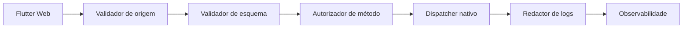

# C4 nível 3: componentes da ponte

Estado: planejado; não representa implementação concluída.

Nenhum componente deve executar método nativo antes de origem, esquema, tamanho, estado e autorização serem validados.
