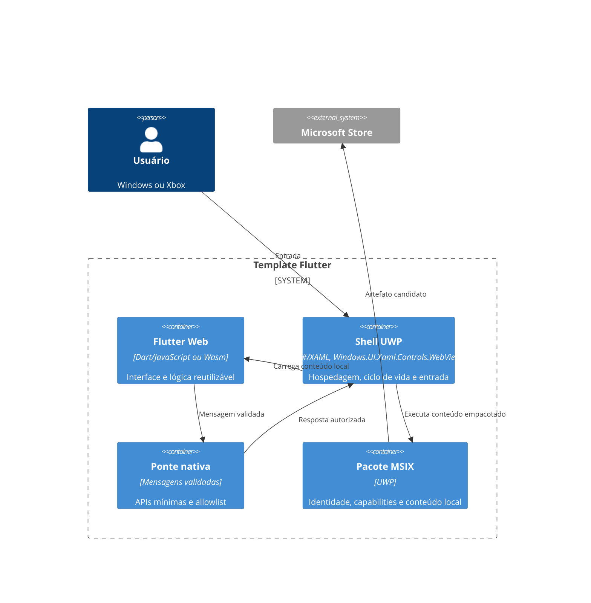

# C4 nível 2: containers

Estado: shell UWP é alvo planejado; o repositório atual ainda contém o template Flutter e o pipeline candidato.

```mermaid
C4Container
    Person(user, "Usuário", "Windows ou Xbox")
    System_Boundary(app, "Template Flutter") {
        Container(web, "Flutter Web", "Dart/JavaScript ou Wasm", "Interface e lógica reutilizável")
        Container(shell, "Shell UWP", "C#/XAML, Windows.UI.Xaml.Controls.WebView", "Hospedagem, ciclo de vida e entrada")
        Container(bridge, "Ponte nativa", "Mensagens validadas", "APIs mínimas e allowlist")
        Container(msix, "Pacote MSIX", "UWP", "Identidade, capabilities e conteúdo local")
    }
    System_Ext(store, "Microsoft Store")
    Rel(user, shell, "Entrada")
    Rel(shell, web, "Carrega conteúdo local")
    Rel(web, bridge, "Mensagem validada")
    Rel(bridge, shell, "Resposta autorizada")
    Rel(shell, msix, "Executa conteúdo empacotado")
    Rel(msix, store, "Artefato candidato")
```
