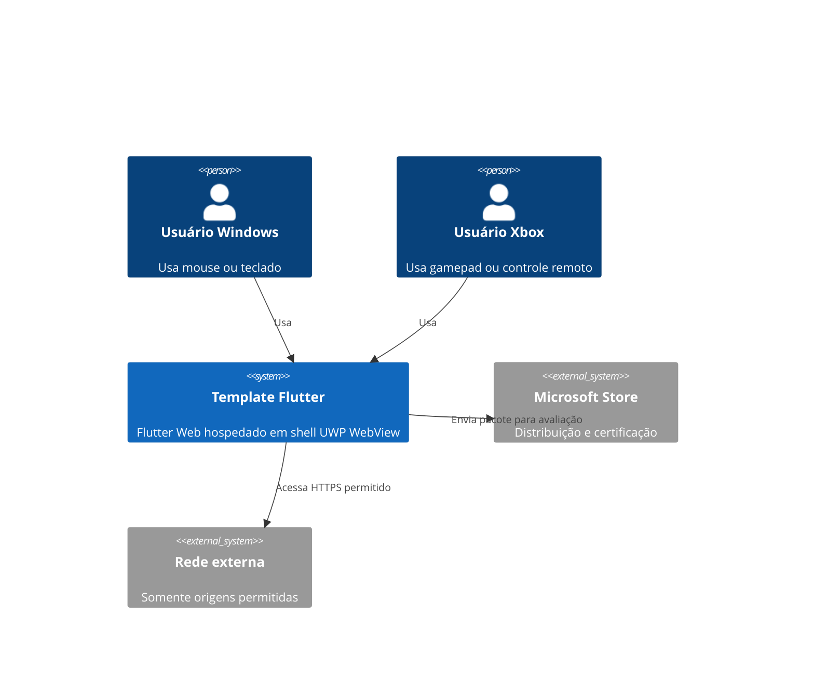

# C4 nível 1: contexto

Estado: vigente para prototipação; Xbox não validado.

O diagrama mostra o objetivo do sistema e suas fronteiras. Compatibilidade Xbox depende de evidência em dispositivo real.
