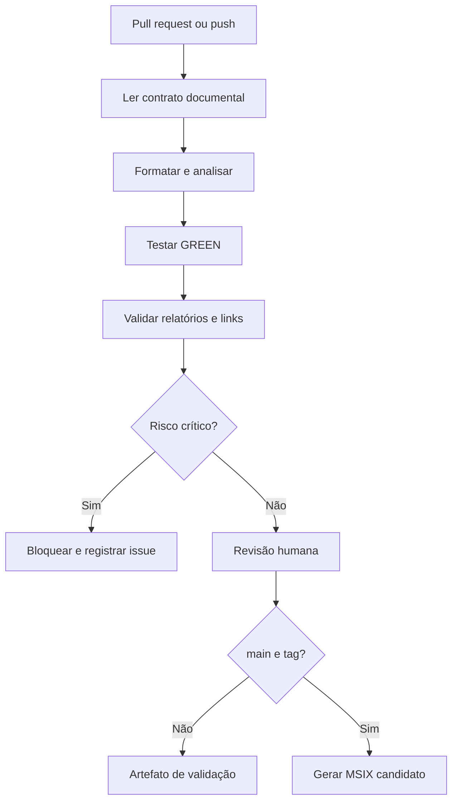

# UML 2.x: atividade CI/CD

```mermaid
flowchart TD
    A[Pull request ou push] --> B[Ler contrato documental]
    B --> C[Formatar e analisar]
    C --> D[Testar GREEN]
    D --> E[Validar relatórios e links]
    E --> F{Risco crítico?}
    F -- Sim --> G[Bloquear e registrar issue]
    F -- Não --> H[Revisão humana]
    H --> I{main e tag?}
    I -- Não --> J[Artefato de validação]
    I -- Sim --> K[Gerar MSIX candidato]
```
