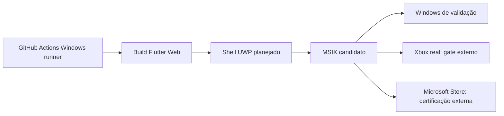

# UML 2.x: implantação

```mermaid
flowchart LR
    R[GitHub Actions Windows runner] --> W[Build Flutter Web]
    W --> U[Shell UWP planejado]
    U --> M[MSIX candidato]
    M --> PC[Windows de validação]
    M --> XB[Xbox real: gate externo]
    M --> S[Microsoft Store: certificação externa]
```

O pipeline atual não prova a execução nos nós Xbox ou Store.
