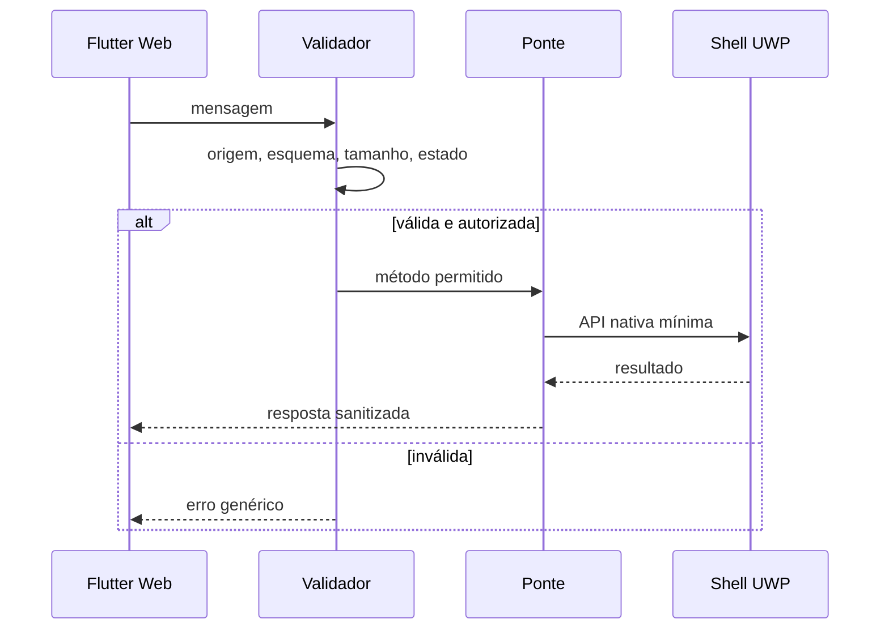

# UML 2.x: sequência WebView

```mermaid
sequenceDiagram
    participant W as Flutter Web
    participant V as Validador
    participant B as Ponte
    participant N as Shell UWP
    W->>V: mensagem
    V->>V: origem, esquema, tamanho, estado
    alt válida e autorizada
        V->>B: método permitido
        B->>N: API nativa mínima
        N-->>B: resultado
        B-->>W: resposta sanitizada
    else inválida
        V-->>W: erro genérico
    end
```
