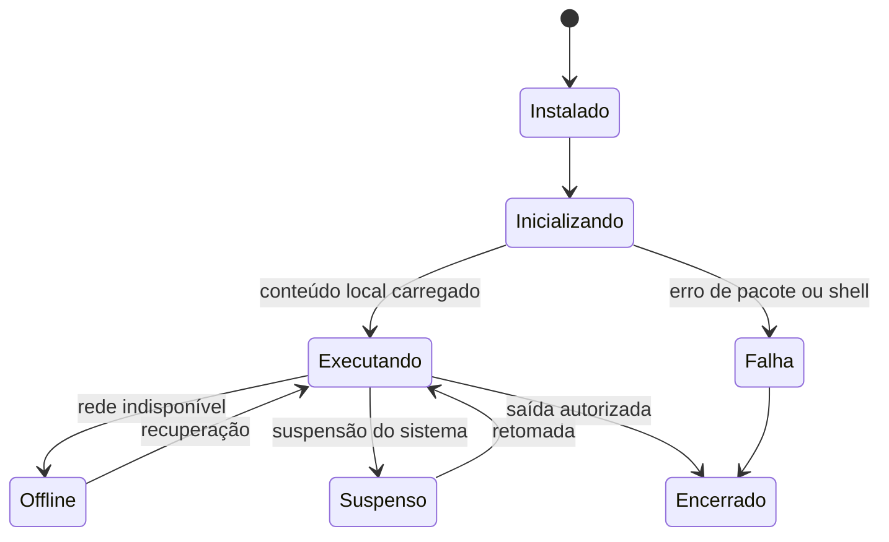

# UML 2.x: estados do aplicativo

```mermaid
stateDiagram-v2
    [*] --> Instalado
    Instalado --> Inicializando
    Inicializando --> Executando: conteúdo local carregado
    Inicializando --> Falha: erro de pacote ou shell
    Executando --> Offline: rede indisponível
    Offline --> Executando: recuperação
    Executando --> Suspenso: suspensão do sistema
    Suspenso --> Executando: retomada
    Executando --> Encerrado: saída autorizada
    Falha --> Encerrado
```
