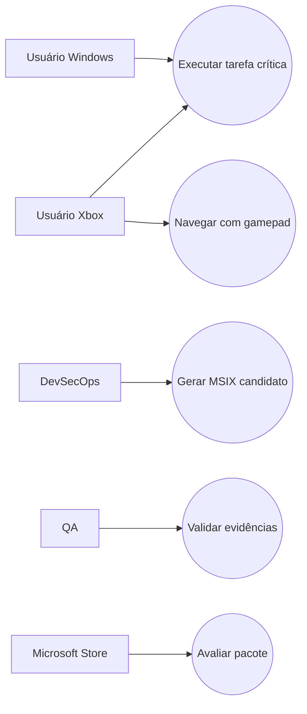

# UML 2.x: casos de uso

```mermaid
flowchart LR
    UW[Usuário Windows] --> U1((Executar tarefa crítica))
    UX[Usuário Xbox] --> U1
    UX --> U2((Navegar com gamepad))
    D[DevSecOps] --> U3((Gerar MSIX candidato))
    Q[QA] --> U4((Validar evidências))
    M[Microsoft Store] --> U5((Avaliar pacote))
```

Os casos de uso não implicam certificação ou compatibilidade já demonstrada.
